<p align="center">
  <a href="https://lyingterminals.com">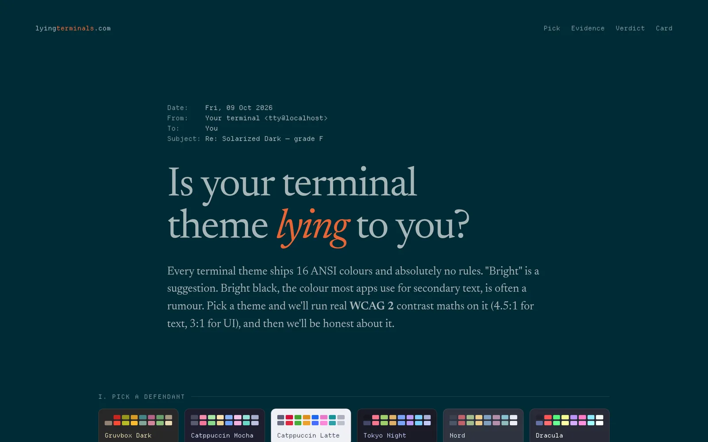</a>
</p>

<h1 align="center">Is your terminal theme lying to you?</h1>

<p align="center">
  <b><a href="https://lyingterminals.com">lyingterminals.com</a></b> · contrast roasts for terminal themes<br>
  <sub>A single HTML file, with no build step, no tracking and no network requests.</sub>
</p>

---

Every terminal theme ships 16 ANSI colours and **absolutely no rules**. "Bright" is a suggestion. Bright black, the colour most apps use for secondary text, is often a rumour.

Pick a theme, or paste your own from Ghostty or kitty. The page runs real **WCAG 2** contrast maths on every colour against its own background (4.5:1 for text, 3:1 for UI), catches the bright colours that are secretly *dimmer* than the normal ones, then grades and roasts the theme:

> *"bright black: 2.4:1. Secondary text? More like tertiary vibes."*
>
> *"Bright black is literally your background colour (#002b36). 1.0:1. It's not secondary text, it's a secret."*
>
> *"6/7 bright colours are dimmer than their regular versions. Your palette has a "bright" mode the way a fridge has a light."*

## The whole page changes into your theme

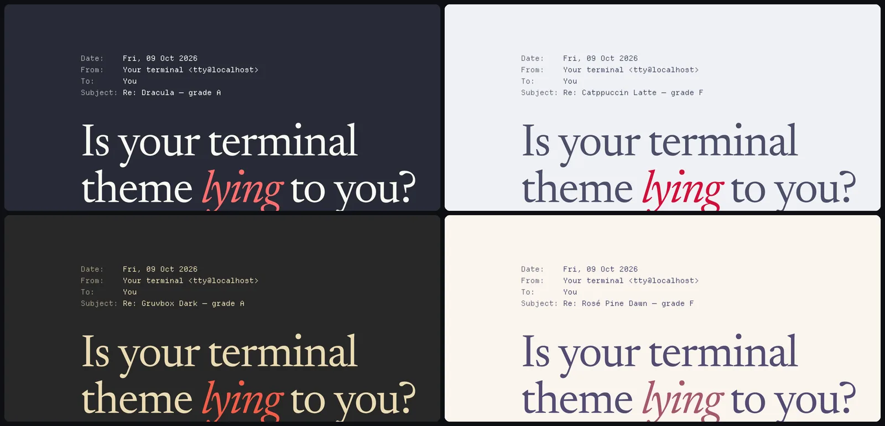

Choose a theme and the background, text, accents and borders all switch to its colours. Like Pi's system theme, the page doesn't take the palette on trust. Its own text and accents are moved in **OKLCH** until they clear 7:1 for body text and 4.5:1 for accents. Only the swatches are left exactly as the theme defines them.

## The evidence

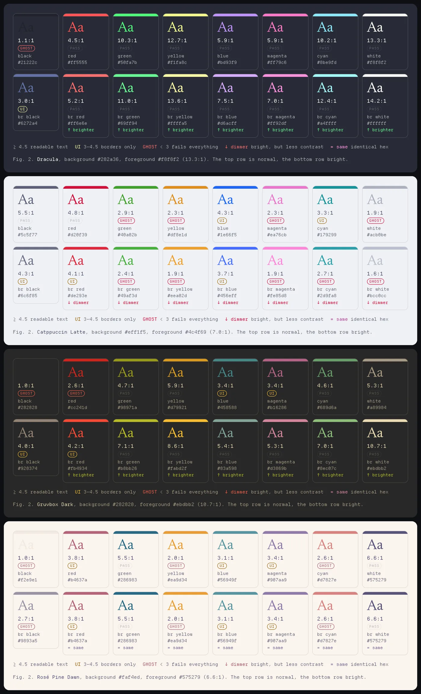

Each tile shows a colour as text on the theme's own background, with its contrast ratio. Tiles under 3:1 are marked **GHOST** and tiles between 3:1 and 4.5:1 are marked **UI**. Each bright colour is labelled ↑ brighter, ↓ dimmer, or = same compared with its normal twin.

## 17 defendants, or bring your own

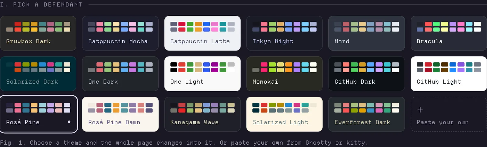

Gruvbox Dark · Catppuccin Mocha / Latte · Tokyo Night · Nord · Dracula · Solarized Dark / Light · One Dark / Light · Monokai · GitHub Dark / Light · Rosé Pine / Dawn · Kanagawa Wave · Everforest Dark. You can also paste `palette = N=#hex` (Ghostty), `color0 #hex` (kitty), or just 18 hex codes.

## The verdict, and a card to share

<table>
  <tr>
    <td width="50%">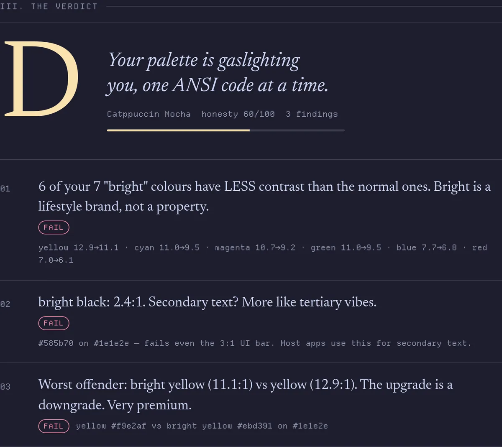</td>
    <td width="50%">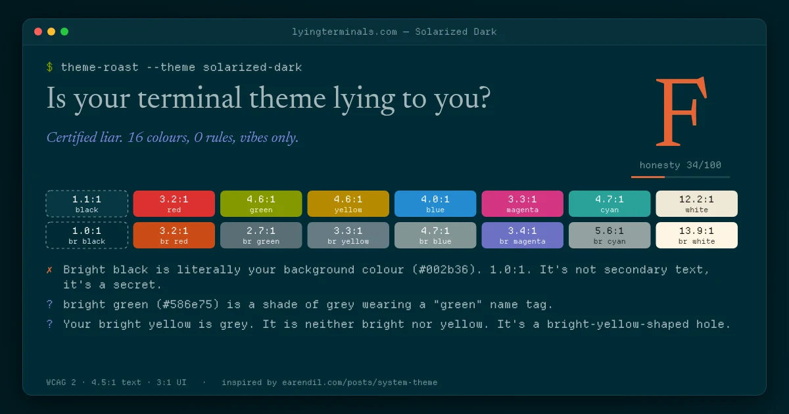<br><br>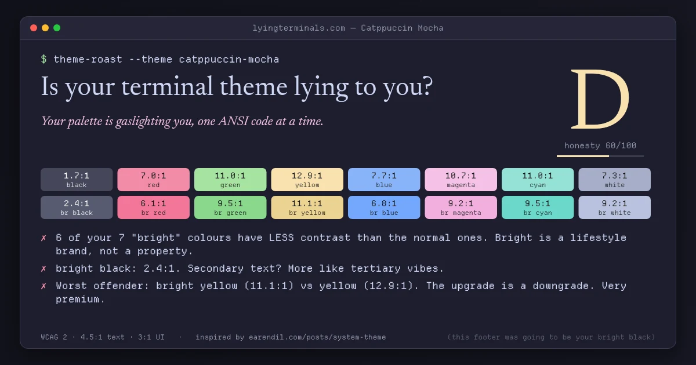<br><br>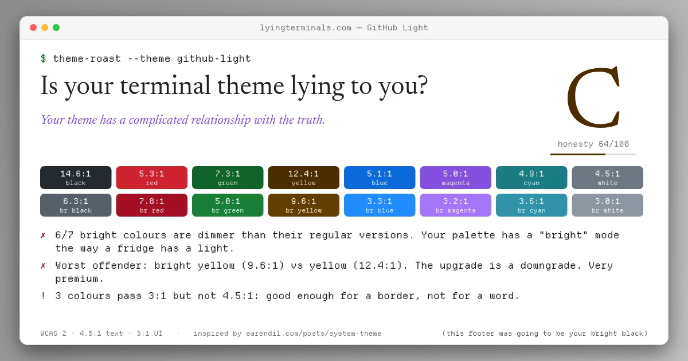</td>
  </tr>
</table>

The verdict card is drawn by hand on a `<canvas>` at 1200 × 630, in the theme's own colours, using no libraries. Download it as a PNG, copy the roast as text, or copy a link that reopens the same theme.

## VI. Cross-examination: a terminal in your theme's raw colours

Section VI is a small DOM terminal (no xterm.js) painted in the selected theme's **raw** ANSI colours, so you see what the theme really looks like. Press <kbd>`</kbd> anywhere to open it as a drop-down console; <kbd>Esc</kbd> closes it.

<table>
  <tr>
    <td width="68%">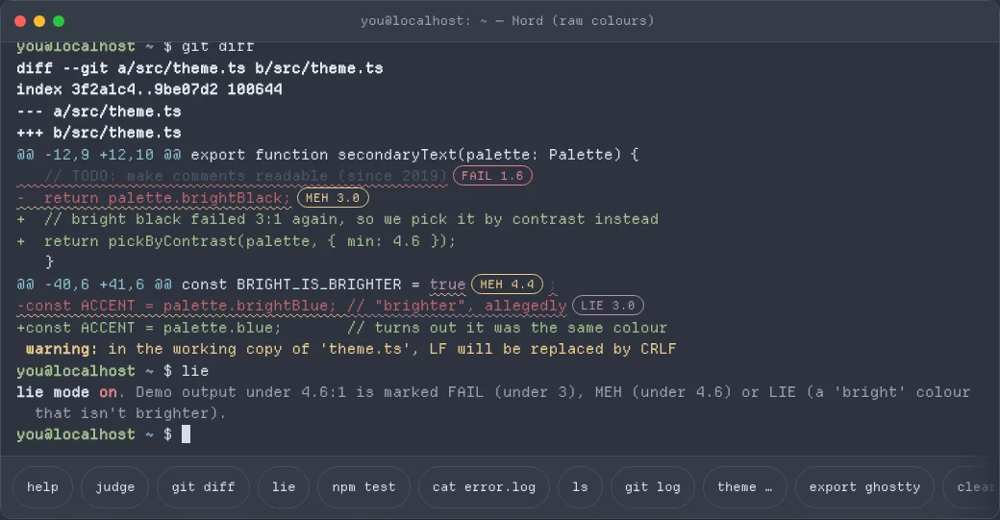</td>
    <td width="32%">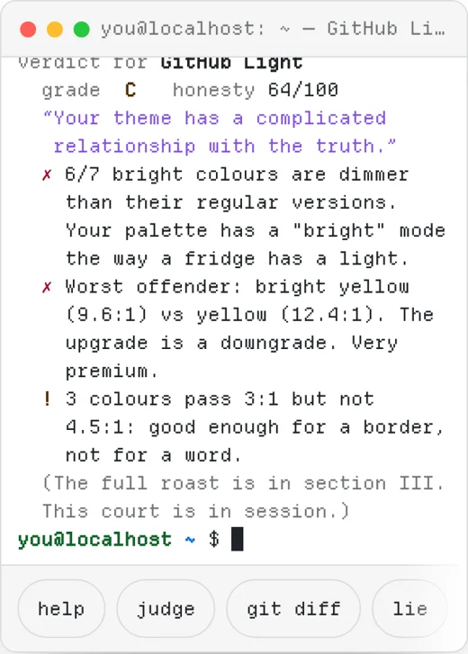</td>
  </tr>
</table>

Commands: `help`, `theme <name>` (Tab completes), `judge`, `fix` (lift failing colours by OKLCH lightness only; `fix --undo`), `export ghostty|kitty|iterm`, `ls`, `git diff`, `git log`, `npm test`, `cat error.log`, `lie`, `clear`. `lie` tags every demo output span under 4.6:1 with FAIL, MEH or LIE pills. The terminal's own UI text uses the page's contrast-safe colours; only the fake demo output is allowed to lie.

### Or ask from your actual terminal

```sh
curl lyingterminals.com          # ANSI test card: all 16 colours as text and blocks, dim/bold samples
curl lyingterminals.com/plain    # same card without escape codes
```

The server can't see your terminal's colours, so there's no grade, just a test card you can judge with your own eyes. Browsers get the normal page.

## On your phone, too

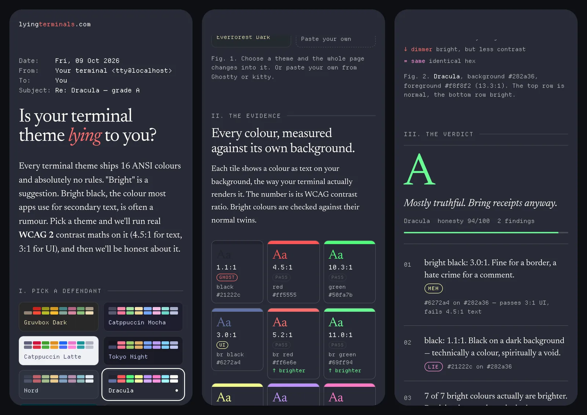

## How it works

- **Contrast:** WCAG 2.x relative-luminance ratio, rounded *down* so a fail is never rounded up into a pass.
- **Findings:** bright vs. normal contrast, identical hex codes ("in a trenchcoat"), bright colours that have lost their chroma and turned grey (measured in OKLCH), bright black against the background, foreground contrast, and any colour under 3:1 or 4.5:1. The findings are scored into a grade from A+ to F.
- **Page skin:** colours are converted OKLCH → sRGB with gamut clipping. Lightness is moved away from the background until the target contrast is met, with hue kept and chroma capped.
- **Single file:** `index.html` contains everything: CSS, JS, and subsetted, embedded fonts. It works offline from `file://`.

## Files

| File | What |
|---|---|
| `index.html` | The entire site |
| `og.png` | 1200×630 social card, generated by the page itself |
| `wrangler.toml` | Cloudflare Worker config: static assets from `./site`, the analytics Worker, and the D1 binding |
| `src/worker.js` | Serves the assets and counts anonymous visits; private `/stats` dashboard |
| `migrations/` | D1 schema for the daily counters |
| `docs/` | README images |
| `functions/_middleware.js` | Pages only: adds `X-Robots-Tag: noindex, nofollow` and a robots meta on `*.pages.dev` (staging/previews). Production is served by the Worker and stays indexable. |
| `og/og.html` | Source of `og.png` (render at 1200×630 with Playwright) |

## Deploy

```sh
mkdir -p site && cp index.html og.png site/
npx wrangler d1 migrations apply lyingterminals-stats --remote   # first time only
npx wrangler secret put STATS_KEY                                # first time only
npx wrangler deploy
```

This needs `wrangler login` with access to the account in `wrangler.toml`. The Worker `lyingterminals` serves `./site` on `lyingterminals.com` and `www.lyingterminals.com`.

### Per-theme share links (staging)

`/t/<slug>` (for example `/t/nord`) serves the page opened on that theme, with its own `og:title`, description and card at `/og/<slug>.png`. It's a Pages Function (`functions/t/[slug].js`, data in `lib/themes.json`); cards are rendered by `og/gen_cards.py` from the built page. Unknown slugs redirect to `/`. **Production note:** lyingterminals.com is served by the Worker, which needs the same `/t/<slug>` route before this ships there.

### Tests

`python tests/test_site.py http://localhost:8000/index.html` (serve the repo root first). Runs desktop + 390px checks, axe-core, the terminal commands, `fix`, focus handling and touch/wheel scrolling. CI runs it on every push and PR.

## Privacy-friendly analytics

`src/worker.js` runs only for the page itself (`run_worker_first = ["/"]`). Everything else, including `og.png`, is served directly from static assets. For each human `GET /`, the Worker adds to three **daily aggregate counters** in D1: total visits, referrer *host* (or `direct`), and country (`request.cf.country`). When someone clicks a theme, the page sends one `navigator.sendBeacon("/hit?t=<theme>")` per theme per tab session. These beacons are only accepted from the site's own origin, only for known theme keys, and there is a daily cap.

The Worker stores no IPs, no user agents, no cookies and no per-visitor IDs. Bots and link-preview fetchers are skipped. The dashboard is at `/stats?key=…` (HTML, or add `&format=json`). It is protected by the `STATS_KEY` secret and returns a 404 without the key.

## Theme sources

Preset hex values were checked against their published sources:

- Gruvbox Dark: [morhetz/gruvbox](https://github.com/morhetz/gruvbox)
- Catppuccin Mocha / Latte: [catppuccin/palette](https://github.com/catppuccin/palette) `ansiColors`
- Tokyo Night, One Dark / Light, Monokai, GitHub Dark / Light, Everforest Dark: Ghostty built-in themes from [iTerm2-Color-Schemes](https://github.com/mbadolato/iTerm2-Color-Schemes) `ghostty/` (TokyoNight, Atom One Dark/Light, Monokai Classic, GitHub Dark/Light Default, Everforest Dark Med)
- Nord: [nordtheme/alacritty](https://github.com/nordtheme/alacritty)
- Dracula: [dracula/ghostty](https://github.com/dracula/ghostty)
- Rosé Pine / Dawn: [rose-pine/ghostty](https://github.com/rose-pine/ghostty)
- Kanagawa Wave: [rebelot/kanagawa.nvim](https://github.com/rebelot/kanagawa.nvim) (Ghostty extra)
- Solarized Dark / Light: [altercation/solarized](https://github.com/altercation/solarized) terminal table

## Credits

Made by **[@AnouarTahiri](https://x.com/AnouarTahiri)**.

Inspired by **[“There are many themes, but this one is yours”](https://earendil.com/posts/system-theme/)** by Earendil, the post about Pi's system theme. That post covers how the ANSI palette has no rules, how bright colours often have *less* contrast, how bright black fails 3:1 in most dark themes, and how a Catppuccin pink turned hot pink.

Fonts embedded in `index.html`: [Departure Mono](https://departuremono.com) by Helena Zhang and [Newsreader](https://github.com/productiontype/Newsreader) by Production Type, both under the SIL Open Font License 1.1.

**Acknowledgements:** this project owes an unpayable debt to Seb Van Papple, who, in a single act of feedback, reunited the reader with the top of the page. Scholars disagree on whether he is a designer, a prophet, or both. We have stopped asking.

## License

Code is [MIT](LICENSE). The embedded fonts remain under the SIL Open Font License 1.1.
